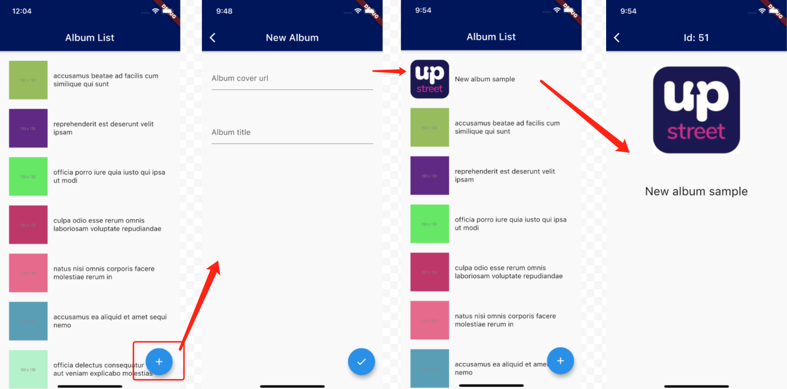
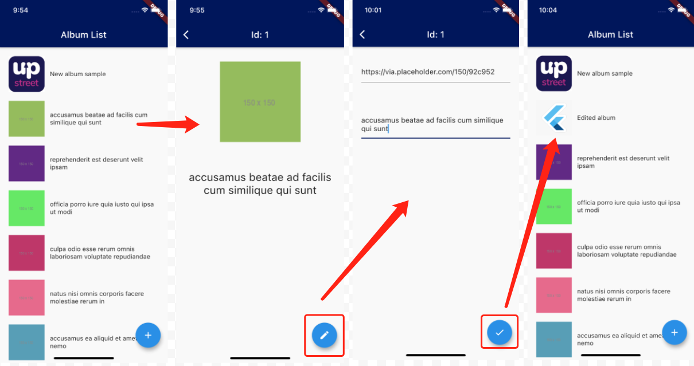

# Upstreet Flutter code challenge - The album photo list

## Requirement

### 1. Pull the dummy data from the provided url to render a list. The list items contain a thumbnail and a title. 

  

### 2. Click on any of the items to view the details

  

### 3. Create a new album

- Open the NewAlbum page after clicking the "Add" floating button on the AlbumList page. 
- Back to the AlbumList page after saving the new album data.
- The new added album should be the first item of the list.
- The `id` of the new album should be an increment of the last existing item's `id`.

  

### 4. Edit an album

- Click the "Edit" floating button on the AlbumDetails page to start editing the album.
- The cover url and the title are editable.
- Back to the AlbumList page after saving the changes by clicking the "Save" floating button.
- The AlbumList page should refresh and display the latest data.

  

## Data source

Please use https://jsonplaceholder.typicode.com/albums/1/photos as the data source, you can also preview the response structure by clicking to launch the url.

## Add-on

- You're not required to build a pixel-perfect UI as the above sample image.
- Feel free to create the necessary files with a good project structure.

///////////////////////////////////////////////////////////////////////////////////

Author's ReadMe

1. This is a simple app developed with flutter stable version.
2. I have included an android apk to test this app. 
3. if you want to run this app, make sure to have android studio@latest, flutter stable version @latest is installed.
4. If not you can ask me, I will write the instruction to install them.
5. In this app, an api is fetched for album list and display on first screen.
6. you can add new albums and edit the already existing ones.
7. For each album, the image is uploaded from the placeholder.com (online services) which I have not implemented, thus while adding any new album ior editing the existing the album make sure to add the valid proper url for the album cover. Or the album thumbnail and the cover image will be blank.
8. I have implemented the shared preferences for the state management. So the data resides until refreshed.

To Do
1. With placeholder url for image, user should be able to add image locally so as to test the app offline (not added yet.)
2. for the edit page, new fields like id, thumbnail url field should be available. (not added yet).
3. cards can be given better design, as well as album detail page can be redesigned.
